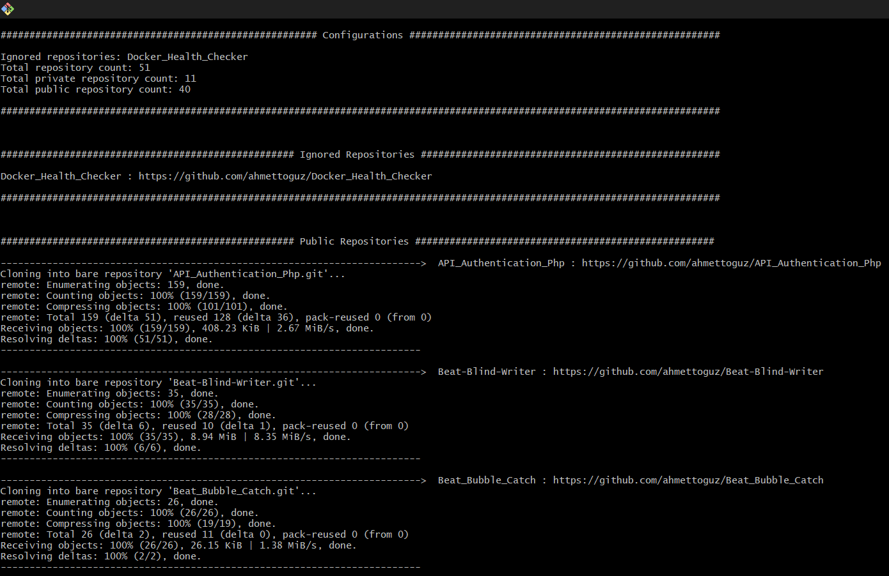

<h1 id="top" align="center">Github <br/> Repository Backup</h1> 

<br>

<div align="center">
    
</div>

## 🔍 Table of Contents

- [About Project](#intro)
- [Technologies](#technologies)
- [Demo](#demo)
- [Features](#features)
- [Prerequisites](#prerequisites)
- [System Startup](#system-startup)
- [Contributors](#contributors)

<br/>

<h2 id="intro">📌 About Project</h2> 

This project enables the creation of bare backups for both your private and public GitHub repositories, ensuring the safety of your repositories with automated processes.

<br/>

<h2 id="technologies">☄️ Technologies</h2>

[](https://git-scm.com/)

[](https://github.com/ahmettoguz)

[](https://www.gnu.org/software/bash/)

<br/>

<h2 id="demo">🎥 Demo</h2> 

<div>
    
</div>

<br/>

<h2 id="features">🔥 Features</h2>

* Both private and public repositories can be backed up.
  
<br/>

<h2 id="prerequisites">🔒 Prerequisites</h2> 

* Github access token. (Obtainable from https://github.com/settings/tokens)

<br/>


<h2 id="system-startup">🚀 System Startup</h2> 

* Place your GitHub token in the `src/config/config.sh` file.
* If there are any repositories you want to ignore, add them to the `src/config/config.sh` file as well.
* Run backup bash script file.

```
bash backup.sh
```

* After getting bare clone, to be able to restore repository run that command and create it.

```
git clone <Repo name>.git
```

* Associate local repository with remote repository

```
git remote set-url origin https://github.com/<User name>/<Repo name>
```

* Check remote url

```
git remote -v
```

<br/>

<h2 id="contributors">👥 Contributors</h2> 

<a href="https://github.com/ahmettoguz" target="_blank"></a> 

### [🔝](#top)
