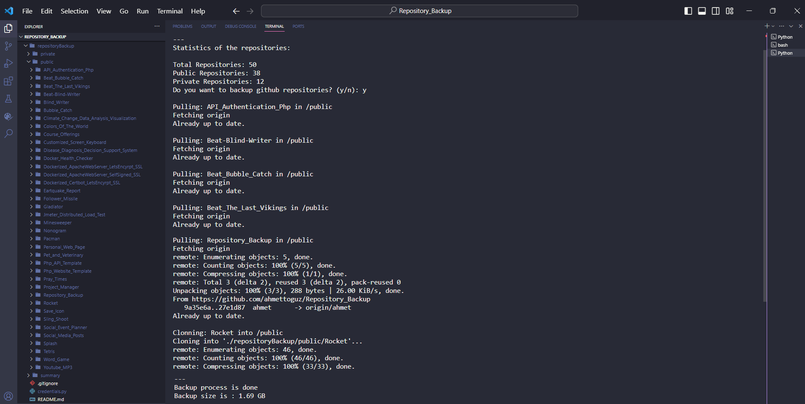

<h1 align="center">Github Repository Backup</h1> 

<br>

<div align="center">
    
</div>

<br/>

## Table of Contents

- [Introduction](#introduction)
- [Demo](#demo)
- [Prerequisites](#prerequisites)
- [Instructions](#instructions)
- [Technologies](#technologies)
- [Features](#features)
- [Contributors](#contributors)

<br/>

## Introduction

This project facilitates the creation of backups for your private and public GitHub repositories.

<br/>

## Demo

<div align="center">
    
</div>

<br/>

## Prerequisites

* Github access token. (Obtainable from https://github.com/settings/tokens)
  
* Python

<br/>

## Instructions

```
bash setCredentials.sh
```

```
python backup.py
```
<br/>

## Technologies


[](https://www.python.org/)

[](https://github.com/ahmettoguz)

<br/>

## Features

* Private and public repositories can be backed up.
  
* Non-existent repositories can be cloned, and existing repositories can be pulled without cloning again.
  
<br/>

## Contributors

<a href="https://github.com/ahmettoguz" target="_blank"></a>

[🔝](#github-repository-backup)
